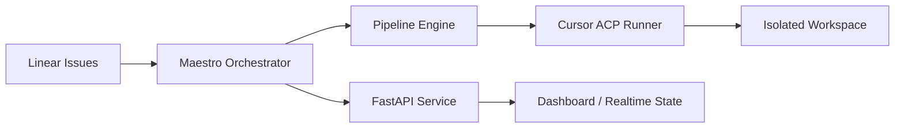

# Maestro

<p align="center">
  
  
  
  
  
</p>

<p align="center">
  <strong>Harness engineering for autonomous software development.</strong>
</p>

<p align="center">
  Maestro turns Linear issues into Cursor-powered coding runs inside isolated workspaces,
  with orchestration, visibility, and human control built in.
</p>

---

## What Is Maestro?

Maestro is a Symphony-compatible coding agent orchestrator built to operationalize
AI software agents, not just run them once.

It connects the source of work, the execution environment, and the orchestration
layer into one repeatable system:

- `Linear` is the source of truth for work.
- `Cursor ACP` executes the agent run.
- `Isolated workspaces` keep runs reproducible and contained.
- `FastAPI + WebSocket` expose service state and realtime visibility.

In short, Maestro is the harness around the agent.

## Why It Exists

Running an AI coding agent once is easy.

Running it repeatedly across real issues, with isolation, retries, workflow
control, and observability, is a different problem entirely.

Maestro is designed for that layer.

## Core Capabilities

- Turn `Linear` issues into executable coding runs
- Create or reuse isolated per-issue workspaces
- Execute `Cursor` agent sessions in a controlled workflow
- Orchestrate multi-step runs with built-in scheduling and pipeline engine
- Expose service and operator APIs via `FastAPI`
- Stream live state updates over `WebSocket`
- Support long-running automation through configurable workflow definitions

## Architecture



## Repository Layout

```text
.
├── src/maestro/           # Core service, orchestration, graph, API, worker logic
├── dashboard/             # Lightweight dashboard frontend
├── docs/                  # Architecture notes and phased roadmap
├── config/                # Runtime configuration
├── WORKFLOW.md            # Prompt and workflow definition
└── tests/                 # Test suite
```

## Quick Start

### Option 1: Docker (Recommended)

```bash
# 1. Clone and configure
cp .env.example .env
# Edit .env with your LINEAR_API_KEY and CURSOR_API_KEY

# 2. Build and start
docker compose up -d

# 3. View logs
docker compose logs -f

# 4. Check status
curl http://localhost:8080/api/v1/state
```

### Option 2: Local Install

**Requirements:**

- Python `3.11+`
- Cursor CLI with `agent`
- A valid `LINEAR_API_KEY`
- Cursor authentication via `CURSOR_API_KEY`, `CURSOR_AUTH_TOKEN`, or `agent login`

```bash
python3 -m venv .venv
. .venv/bin/activate
pip install -e '.[dev]'

export LINEAR_API_KEY=your_linear_key
export CURSOR_API_KEY=your_cursor_key
```

## Usage

List candidate issues:

```bash
maestro list
```

Run a single issue:

```bash
maestro run MAE-42
```

Start the orchestration service:

```bash
maestro start --port 8080
```

## Philosophy

The value of an AI coding agent does not come only from the model.
It comes from the system that informs it, constrains it, monitors it, and
turns it into a reliable part of software delivery.

That system is the harness.

## Roadmap

- richer scheduling and concurrency control
- deeper dashboard and operator workflows
- persistent checkpoints and recovery
- stronger sandboxing and isolation
- broader MCP and toolchain integrations

## Status

Maestro is evolving from a foundation scaffold into a full harness engineering
platform for autonomous software delivery.
