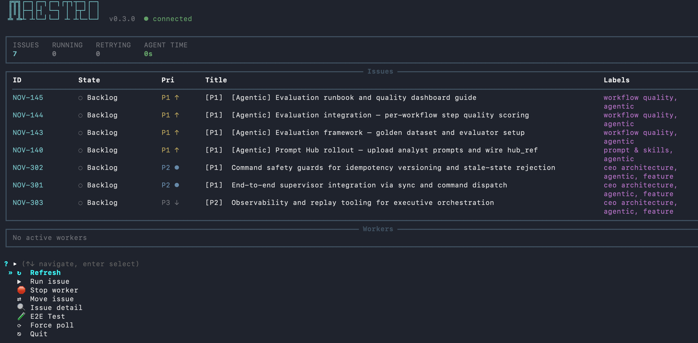
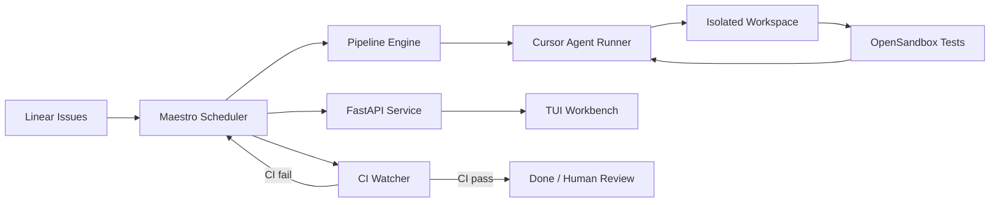

# Maestro

<p align="center">
  
  
  
  
  
</p>

<p align="center">
  <strong>Harness engineering for autonomous software development.</strong>
</p>

<p align="center">
  Maestro turns Linear issues into Cursor-powered coding runs inside isolated workspaces,
  with orchestration, visibility, and human control built in.
</p>

---

## What Is Maestro?

Maestro is a Symphony-compatible coding agent orchestrator built to operationalize
AI software agents, not just run them once.

It connects the source of work, the execution environment, and the orchestration
layer into one repeatable system:

- `Linear` is the source of truth for work, filtered by team and assignee.
- `Cursor ACP` executes the agent run inside isolated workspaces.
- `Pipeline Engine` orchestrates parse → execute → update in a controlled sequence.
- `FastAPI + WebSocket` expose service state and realtime visibility.
- `TUI Workbench` provides a terminal-native interface for monitoring and control.

In short, Maestro is the harness around the agent.

## Why It Exists

Running an AI coding agent once is easy.

Running it repeatedly across real issues, with isolation, retries, workflow
control, and observability, is a different problem entirely.

Maestro is designed for that layer.

## Core Capabilities

- Filter Linear issues by **team and assignee** — manage only your own work in shared workspaces
- Turn `Linear` issues into executable coding runs with isolated per-issue workspaces
- Execute `Cursor` agent sessions in a controlled multi-turn pipeline (up to 10 turns)
- **Dual-model strategy** — plan with Opus, code with Sonnet (configurable `plan_model` + `model`)
- **Safe dispatch control** — `auto_dispatch: false` (default) prevents automatic agent dispatch; use TUI for manual runs in local dev, enable for Docker production
- Run up to N concurrent agent tasks with automatic retry (max 3 retries with exponential backoff), stall detection, and 10-minute cooldown between runs
- **Automated workspace bootstrap** — `after_create` hook clones the repo; `before_run` hook auto-rebases onto latest `origin/main` every turn
- Inject **global Cursor rules** (code quality, style, testing, plan-before-coding) and **project Skills** (git, PR, CI, Linear) into every workspace
- Configure **5 MCPs** (Linear, Playwright, GitHub, GitNexus, Greptile) in every agent workspace
- Run tests in an isolated **OpenSandbox Code Interpreter** after each turn and feed results back to the agent
- **Draft PR workflow** — PRs are created as drafts; only converted to ready for review after human E2E testing passes
- **CI Watcher** — monitors GitHub CI status for issues in `In Review` state; auto-transitions to `Human Review` on success or back to `In Progress` on failure for automated fix
- **E2E Test gate** — TUI provides a `🧪 E2E Test` panel for human end-to-end testing; on pass, converts draft PR to ready and marks issue Done
- Human-in-the-loop via `Human Review` handoff state — agent pauses, workspace preserved
- Portable Docker deployment — cursor-agent CLI downloaded automatically at build time
- Terminal workbench (`make tui`) with **← Back navigation** for real-time monitoring, issue management, and E2E testing

## TUI Workbench

<p align="center">
  
</p>

<p align="center"><em>Terminal workbench — real-time issue tracking, worker monitoring, and one-click actions</em></p>

## Architecture



## Repository Layout

```text
.
├── src/maestro/           # Core service
│   ├── agent/             # Headless runner, event normalization
│   ├── api/               # FastAPI routes (issues, runs, state, refresh)
│   ├── github/            # GitHub REST client (PR lookup, CI checks)
│   ├── linear/            # Linear GraphQL client and models
│   ├── orchestrator/      # Scheduler, reconciler, retry, CI watcher, concurrency
│   ├── tui/               # Terminal workbench (rich + questionary)
│   ├── worker/            # Multi-turn worker per issue
│   └── workflow/          # WORKFLOW.md parser, config, template engine
├── docs/                  # Architecture notes, SKILL evolution roadmap
├── config/                # Runtime configuration
├── scripts/               # install-cursor-cli.sh, start-opensandbox.sh
├── WORKFLOW.md            # Prompt template, tracker config, hooks, agent instructions
├── Dockerfile             # Multi-stage build — cursor-agent installed at build time
├── docker-compose.yml     # Maestro + OpenSandbox services
├── Makefile               # One-command developer experience
└── tests/                 # Test suite
```

## Quick Start

### Option 1: Docker (Recommended — no local setup required)

```bash
# 1. Clone and configure
cp .env.example .env
# Edit .env — fill in LINEAR_API_KEY, CURSOR_API_KEY, GITHUB_TOKEN

# 2. Build and start (cursor-agent downloaded automatically)
make up

# 3. Open the TUI workbench (in a separate terminal)
make tui

# 4. View logs
make logs
```

The Docker build downloads the official Cursor agent CLI for Linux at build time.
No host-side cursor installation required.

### Option 2: Local Development

**Requirements:**

- Python `3.11+`
- Cursor agent CLI (`cursor-agent` on PATH — install via `curl https://cursor.com/install -fsS | bash`)
- A valid `LINEAR_API_KEY`
- Cursor authentication via `CURSOR_API_KEY` or `agent login`

```bash
# Install dependencies
make install

# Start Maestro (auto-sources .env; auto_dispatch defaults to false)
make dev

# Open TUI in another terminal — run issues manually from here
make tui
```

> **Note:** In local mode, `auto_dispatch` defaults to `false` so Maestro won't
> automatically open Cursor windows. Use the TUI to select and run individual issues.

## Configuration

All behaviour is driven by `WORKFLOW.md`. Key settings:

```yaml
tracker:
  kind: linear
  api_key: $LINEAR_API_KEY
  team_id: "your-linear-team-id"
  assignee: "me"                       # only process issues assigned to you
  active_states: [Todo, In Progress]
  handoff_states: [Human Review, In Review]

cursor:
  model: sonnet-4.6                    # model for coding turns
  plan_model: opus-4.6                 # model for planning turn (turn 1)

agent:
  auto_dispatch: false                 # false = manual via TUI; true = auto-dispatch
  max_concurrent_agents: 2
  max_turns: 10

github:
  token: $GITHUB_TOKEN
  owner: your-org
  repo: your-repo
  ci_watch_states: [In Review]         # monitor CI for issues in these states
  ci_pass_target_state: Human Review   # where to move on CI pass
  ci_fail_target_state: In Progress    # where to move on CI fail (triggers re-fix)
```

**Dispatch modes:**
- `auto_dispatch: false` (default) — Scheduler monitors state only; use `make tui` to manually run issues. Best for **local development**.
- `auto_dispatch: true` — Scheduler auto-dispatches issues to Cursor agents. Best for **Docker production** (`make up`).

## Makefile Targets

| Target | Description |
|--------|-------------|
| `make up` | Build and start all Docker services |
| `make down` | Stop all services |
| `make restart` | Rebuild and restart |
| `make logs` | Tail all service logs |
| `make tui` | Launch terminal workbench |
| `make dev` | Run Maestro locally (no Docker) |
| `make test` | Run unit tests |
| `make clean` | Remove containers, volumes, and caches |

## Environment Variables

| Variable | Required | Description |
|----------|----------|-------------|
| `LINEAR_API_KEY` | Yes | Linear personal API key |
| `CURSOR_API_KEY` | Yes | Cursor API key for agent authentication |
| `GITHUB_TOKEN` | Recommended | For GitHub MCP, PR creation, and CI Watcher |
| `GREPTILE_API_KEY` | Optional | For Greptile code-search MCP |
| `SANDBOX_DOMAIN` | Optional | OpenSandbox server URL (set automatically in Docker) |
| `SANDBOX_API_KEY` | Optional | OpenSandbox authentication key |

## Workflow Lifecycle

```text
Linear Todo ──► In Progress ──► Draft PR ──► In Review ──► Human Review ──► Done
                     ▲                            │              │
                     │                            ▼              ▼
                     └──── CI Fail (auto-fix) ◄─ CI Watcher    E2E Test
                                                                 │  │
                                                           Pass ─┘  └─ Fail
                                                    PR → Ready       ↓
                                                    Issue → Done   In Progress
```

1. **Scheduler** picks up active issues from Linear (when `auto_dispatch: true`) or waits for manual trigger via TUI
2. **Worker** runs the Cursor agent through multi-turn execution (plan → code → test → PR)
3. Agent creates a **draft PR** and moves the issue to **In Review** — the PR stays in draft throughout CI and review
4. **CI Watcher** monitors GitHub CI; on success, transitions to **Human Review**; on failure, moves back to **In Progress** for automated fix
5. **TUI E2E Test** provides a manual quality gate in `Human Review`:
   - **Pass**: converts the draft PR to **ready for review**, then moves the issue to **Done**
   - **Fail**: records failure details, moves back to **In Progress** for the agent to fix

## Human-in-the-Loop

When the agent cannot proceed autonomously (e.g. ambiguous requirements, failing tests),
it moves the Linear issue to **Human Review** state. Maestro:

1. Detects the state change and stops the worker
2. Preserves the workspace for human inspection
3. Does not reschedule until the issue moves back to an active state

The TUI provides an **E2E Test** action for issues in Human Review:
- **Pass**: converts the draft PR to ready for review, marks the issue as Done, and adds a success comment on Linear
- **Fail**: records the failure reason, adds a comment to Linear, and moves the issue back to In Progress for the agent to automatically fix

## Philosophy

The value of an AI coding agent does not come only from the model.
It comes from the system that informs it, constrains it, monitors it, and
turns it into a reliable part of software delivery.

That system is the harness.

## Roadmap

### Multi-Runner Architecture

Maestro currently uses **Cursor ACP** as its sole agent execution backend.
The architecture is designed to evolve into a multi-runner system where different
LLM backends can be used interchangeably:

| Runner | Status | Description |
|--------|--------|-------------|
| **Cursor ACP** | Stable | Current default. Headless CLI with `stream-json` output, multi-turn sessions, MCP support. |
| **Claude Code** | Planned | Anthropic's CLI agent (`claude -p --output-format stream-json`). Similar event protocol to Cursor, native tool use, no MCP config needed. |
| **Codex CLI** | Planned | OpenAI's open-source CLI agent (`codex --full-auto`). Runs locally with sandboxed execution. Will require adapter for its distinct event format and approval model. |

### Other Planned Enhancements

- **Webhook-driven CI** — Replace polling-based CI Watcher with GitHub webhook receiver for instant state transitions
- **Workspace snapshots** — Persist workspace state between runs for faster resumption
- **Multi-repo support** — Handle issues that span multiple repositories
- **Metrics & analytics** — Agent success rate, time-to-completion, cost tracking dashboard
- **Team collaboration** — Multi-user TUI with role-based access and shared visibility

## Status

**v0.4.0** — Safe dispatch control, retry hardening, and TUI navigation improvements.

**Changelog (v0.4.0):**
- Add `auto_dispatch` config (default `false`) — prevents uncontrolled Cursor spawning in local dev
- Add 10-minute cooldown after normal worker completion to prevent re-dispatch loops
- Cap abnormal retries at 3 with exponential backoff (10s → 20s → 40s)
- Add `← Back` navigation to all TUI sub-menus
- `make dev` now auto-sources `.env` file
- Configure Noval-X Linear workspace with `Backlog` state support
