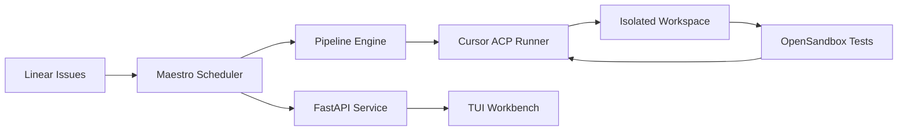

# Maestro

<p align="center">
  
  
  
  
  
</p>

<p align="center">
  <strong>Harness engineering for autonomous software development.</strong>
</p>

<p align="center">
  Maestro turns Linear issues into Cursor-powered coding runs inside isolated workspaces,
  with orchestration, visibility, and human control built in.
</p>

---

## What Is Maestro?

Maestro is a Symphony-compatible coding agent orchestrator built to operationalize
AI software agents, not just run them once.

It connects the source of work, the execution environment, and the orchestration
layer into one repeatable system:

- `Linear` is the source of truth for work, filtered by team and assignee.
- `Cursor ACP` executes the agent run inside isolated workspaces.
- `Pipeline Engine` orchestrates parse → execute → update in a controlled sequence.
- `FastAPI + WebSocket` expose service state and realtime visibility.
- `TUI Workbench` provides a terminal-native interface for monitoring and control.

In short, Maestro is the harness around the agent.

## Why It Exists

Running an AI coding agent once is easy.

Running it repeatedly across real issues, with isolation, retries, workflow
control, and observability, is a different problem entirely.

Maestro is designed for that layer.

## Core Capabilities

- Filter Linear issues by **team and assignee** — manage only your own work in shared workspaces
- Turn `Linear` issues into executable coding runs with isolated per-issue workspaces
- Execute `Cursor` agent sessions in a controlled multi-turn pipeline (up to 10 turns)
- Run up to 2 concurrent agent tasks with automatic retry and stall detection
- Inject **global Cursor rules** (code quality, style, testing) and **project Skills** (git, PR, CI, Linear) into every workspace via `after_create` hook
- Configure **5 MCPs** (Linear, Playwright, GitHub, GitNexus, Greptile) in every agent workspace
- Run tests in an isolated **OpenSandbox Code Interpreter** after each turn and feed results back to the agent
- Human-in-the-loop via `Human Review` handoff state — agent pauses, workspace preserved
- Portable Docker deployment — cursor-agent CLI downloaded automatically at build time
- Terminal workbench (`make tui`) for real-time monitoring and issue management

## Architecture



## Repository Layout

```text
.
├── src/maestro/           # Core service: orchestrator, pipeline, API, worker, agent, linear
├── docs/                  # Architecture notes
├── config/                # Runtime configuration
├── scripts/               # install-cursor-cli.sh, start-opensandbox.sh
├── WORKFLOW.md            # Prompt template, tracker config, hooks, agent instructions
├── Dockerfile             # Multi-stage build — cursor-agent installed at build time
├── docker-compose.yml     # Maestro + OpenSandbox services
├── Makefile               # One-command developer experience
└── tests/                 # Test suite
```

## Quick Start

### Option 1: Docker (Recommended — no local setup required)

```bash
# 1. Clone and configure
cp .env.example .env
# Edit .env — fill in LINEAR_API_KEY, CURSOR_API_KEY, GITHUB_TOKEN

# 2. Build and start (cursor-agent downloaded automatically)
make up

# 3. Open the TUI workbench (in a separate terminal)
make tui

# 4. View logs
make logs
```

The Docker build downloads the official Cursor agent CLI for Linux at build time.
No host-side cursor installation required.

### Option 2: Local Development

**Requirements:**

- Python `3.11+`
- Cursor agent CLI (`cursor-agent` on PATH — install via `curl https://cursor.com/install -fsS | bash`)
- A valid `LINEAR_API_KEY`
- Cursor authentication via `CURSOR_API_KEY` or `agent login`

```bash
# Install dependencies
make install

# Start Maestro
set -a && source .env && set +a
make dev

# Open TUI in another terminal
make tui
```

## Configuration

All behaviour is driven by `WORKFLOW.md`. Key settings:

```yaml
tracker:
  kind: linear
  api_key: $LINEAR_API_KEY
  team_id: "your-linear-team-id"      # restrict to a specific team
  assignee: "me"                       # only process issues assigned to you
  active_states: [Todo, In Progress]
  handoff_states: [Human Review]       # agent pauses here for human approval

agent:
  max_concurrent_agents: 2
  max_turns: 10
```

Use `tracker.assignee: "me"` in a multi-person Linear workspace to ensure Maestro
only picks up issues assigned to you.

## Makefile Targets

| Target | Description |
|--------|-------------|
| `make up` | Build and start all Docker services |
| `make down` | Stop all services |
| `make restart` | Rebuild and restart |
| `make logs` | Tail all service logs |
| `make tui` | Launch terminal workbench |
| `make dev` | Run Maestro locally (no Docker) |
| `make test` | Run unit tests |
| `make clean` | Remove containers, volumes, and caches |

## Environment Variables

| Variable | Required | Description |
|----------|----------|-------------|
| `LINEAR_API_KEY` | Yes | Linear personal API key |
| `CURSOR_API_KEY` | Yes | Cursor API key for agent authentication |
| `GITHUB_TOKEN` | Recommended | For GitHub MCP and PR creation |
| `GREPTILE_API_KEY` | Optional | For Greptile code-search MCP |
| `SANDBOX_DOMAIN` | Optional | OpenSandbox server URL (set automatically in Docker) |
| `SANDBOX_API_KEY` | Optional | OpenSandbox authentication key |

## Human-in-the-Loop

When the agent cannot proceed autonomously (e.g. ambiguous requirements, failing tests),
it moves the Linear issue to **Human Review** state. Maestro:

1. Detects the state change and stops the worker
2. Preserves the workspace for human inspection
3. Does not reschedule until the issue moves back to an active state

## Philosophy

The value of an AI coding agent does not come only from the model.
It comes from the system that informs it, constrains it, monitors it, and
turns it into a reliable part of software delivery.

That system is the harness.

## Status

Maestro is evolving from a foundation scaffold into a full harness engineering
platform for autonomous software delivery.
