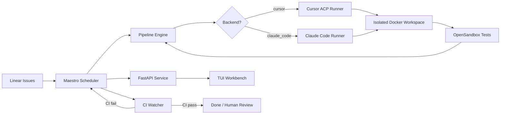

# Maestro

<p align="center">
  
  
  
  
  
  
</p>

<p align="center">
  <strong>Harness engineering for autonomous software development.</strong>
</p>

<p align="center">
  Maestro turns Linear issues into AI-agent-powered coding runs inside isolated Docker workspaces,
  with orchestration, visibility, and human control built in.
  Supports <strong>Cursor ACP</strong> and <strong>Claude Code</strong> as pluggable execution backends.
</p>

---

## What Is Maestro?

Maestro is a Symphony-compatible coding agent orchestrator built to operationalize
AI software agents, not just run them once.

It connects the source of work, the execution environment, and the orchestration
layer into one repeatable system:

- `Linear` is the source of truth for work, filtered by team and assignee.
- `Cursor ACP` or `Claude Code` executes the agent run inside isolated Docker workspaces (configurable via `backend` in WORKFLOW.md).
- `Pipeline Engine` orchestrates parse → execute → update in a controlled sequence.
- `FastAPI + WebSocket` expose service state and realtime visibility.
- `TUI Workbench` provides a terminal-native interface for monitoring and control.

In short, Maestro is the harness around the agent.

## Why It Exists

Running an AI coding agent once is easy.

Running it repeatedly across real issues, with isolation, retries, workflow
control, and observability, is a different problem entirely.

Maestro is designed for that layer.

## Core Capabilities

- **Multi-backend agent execution** — switch between `Cursor ACP` and `Claude Code` via a single config field (`backend: cursor` or `backend: claude_code`)
- Filter Linear issues by **team and assignee** — manage only your own work in shared workspaces
- Turn `Linear` issues into executable coding runs with isolated per-issue Docker workspaces
- Execute agent sessions in a controlled multi-turn pipeline (up to 10 turns)
- **Dual-model strategy** — plan with one model, code with another (configurable `plan_model` + `model` for both backends)
- Run up to N concurrent agent tasks with automatic retry (max 3 retries with exponential backoff), stall detection, and 10-minute cooldown between runs
- **Automated workspace bootstrap** — `after_create` hook clones the repo; `before_run` hook auto-rebases onto latest `origin/main` every turn
- **Unified Skills & Rules** — one set of Skills (`.cursor/skills/`) and Rules (`.cursor/rules/`) shared by both backends; `after_create` hook auto-generates `CLAUDE.md` and `.claude/mcp.json` for Claude Code
- Configure **5 MCPs** (Linear, Playwright, GitHub, GitNexus, Greptile) in every agent workspace — mirrored to both `.cursor/mcp.json` and `.claude/mcp.json`
- Run tests in an isolated **OpenSandbox Code Interpreter** after each turn and feed results back to the agent
- **Draft PR workflow** — PRs are created as drafts; only converted to ready for review after human E2E testing passes
- **CI Watcher** — monitors GitHub CI status for issues in `In Review` state; auto-transitions to `Human Review` on success or back to `In Progress` on failure for automated fix
- **E2E Test gate** — TUI provides a `🧪 E2E Test` panel for human end-to-end testing; on pass, converts draft PR to ready and marks issue Done
- Human-in-the-loop via `Human Review` handoff state — agent pauses, workspace preserved
- **Docker-only deployment** — agents run inside containers, avoiding local client sprawl
- Terminal workbench (`make tui`) with **← Back navigation** for real-time monitoring, issue management, and E2E testing

## TUI Workbench

<p align="center">
  
</p>

<p align="center"><em>Terminal workbench — real-time issue tracking, worker monitoring, and one-click actions</em></p>

## Architecture



## Repository Layout

```text
.
├── src/maestro/           # Core service
│   ├── agent/             # Cursor headless runner, Claude Code runner, event normalization
│   ├── api/               # FastAPI routes (issues, runs, state, refresh)
│   ├── github/            # GitHub REST client (PR lookup, CI checks)
│   ├── linear/            # Linear GraphQL client and models
│   ├── orchestrator/      # Scheduler, reconciler, retry, CI watcher, concurrency
│   ├── tui/               # Terminal workbench (rich + questionary)
│   ├── worker/            # Multi-turn worker per issue
│   └── workflow/          # WORKFLOW.md parser, config, template engine
├── docs/                  # Architecture notes
├── config/                # Runtime configuration
├── scripts/               # install-cursor-cli.sh, start-opensandbox.sh
├── WORKFLOW.md            # Prompt template, tracker config, hooks, agent instructions
├── Dockerfile             # Multi-stage build — cursor-agent installed at build time
├── docker-compose.yml     # Maestro + OpenSandbox services
├── Makefile               # One-command developer experience
└── tests/                 # Test suite (including Claude Code integration tests)
```

## Quick Start

> **Important:** Maestro is designed to run via Docker. Running locally (`make dev`)
> is **not recommended** as it causes the host OS to continuously spawn agent client
> windows (Cursor GUI instances), which can crash your system.

```bash
# 1. Clone and configure
cp .env.example .env
# Edit .env — fill in your keys (see Environment Variables below)

# 2. Choose your backend in WORKFLOW.md
#    backend: cursor       — uses Cursor ACP (requires CURSOR_API_KEY)
#    backend: claude_code  — uses Claude Code CLI (requires ANTHROPIC_API_KEY)

# 3. Build and start (agent CLIs are installed inside the container at build time)
make up

# 4. Open the TUI workbench (in a separate terminal)
make tui

# 5. View logs
make logs
```

The Docker build automatically downloads the agent CLI (Cursor or Claude Code)
at build time. No host-side installation required.

## Configuration

All behaviour is driven by `WORKFLOW.md`. Key settings:

```yaml
backend: cursor                        # "cursor" or "claude_code"

tracker:
  kind: linear
  api_key: $LINEAR_API_KEY
  team_id: "your-linear-team-id"
  assignee: "me"                       # only process issues assigned to you
  active_states: [Todo, In Progress]
  handoff_states: [Human Review, In Review]

cursor:                                # Cursor ACP backend settings
  model: sonnet-4.6                    # model for coding turns
  plan_model: opus-4.6                 # model for planning turn (turn 1)

claude_code:                           # Claude Code backend settings
  command: claude
  model: claude-sonnet-4-20250514
  api_key: $ANTHROPIC_API_KEY
  skip_permissions: true               # skip tool permission prompts (required for automation)
  max_turns_per_invocation: 0          # 0 = unlimited
  max_budget_usd: 0                    # 0 = unlimited; set a positive value to cap spend

agent:
  auto_dispatch: true                  # true for Docker production; false for TUI-only manual runs
  max_concurrent_agents: 2
  max_turns: 10

github:
  token: $GITHUB_TOKEN
  owner: $GITHUB_OWNER                # set in .env — no hardcoded repo references
  repo: $GITHUB_REPO                  # set in .env — switch projects by changing .env only
  ci_watch_states: [In Review]         # monitor CI for issues in these states
  ci_pass_target_state: Human Review   # where to move on CI pass
  ci_fail_target_state: In Progress    # where to move on CI fail (triggers re-fix)
```

**Switching backends:** Change `backend` to `cursor` or `claude_code`. Each backend reads its own config section. The `after_create` hook auto-generates both `.cursor/` and `.claude/` configurations from a single source — no backend-specific hook overrides needed.

**Switching projects:** Change `GITHUB_OWNER`, `GITHUB_REPO`, and `GITHUB_TOKEN` in `.env`. All Skills, hooks, and CI monitoring automatically use these values — no hardcoded repo references in WORKFLOW.md.

## Makefile Targets

| Target | Description |
|--------|-------------|
| `make up` | Build and start all Docker services |
| `make down` | Stop all services |
| `make restart` | Rebuild and restart |
| `make logs` | Tail all service logs |
| `make tui` | Launch terminal workbench |
| `make test` | Run unit tests |
| `make clean` | Remove containers, volumes, and caches |

## Environment Variables

| Variable | Required | Description |
|----------|----------|-------------|
| `LINEAR_API_KEY` | Yes | Linear personal API key |
| `CURSOR_API_KEY` | When `backend: cursor` | Cursor API key for agent authentication |
| `ANTHROPIC_API_KEY` | When `backend: claude_code` | Anthropic API key for Claude Code |
| `GITHUB_TOKEN` | Recommended | For GitHub MCP, PR creation, and CI Watcher |
| `GITHUB_OWNER` | Recommended | GitHub organization or user name (used in Skills and hooks) |
| `GITHUB_REPO` | Recommended | GitHub repository name (used in Skills and hooks) |
| `GREPTILE_API_KEY` | Optional | For Greptile code-search MCP |
| `SANDBOX_DOMAIN` | Optional | OpenSandbox server URL (set automatically in Docker) |
| `SANDBOX_API_KEY` | Optional | OpenSandbox authentication key |
| `MAESTRO_WORKSPACE_ROOT` | Optional | Override workspace root directory (default: `~/maestro_workspaces`) |

## Workflow Lifecycle

```text
Linear Todo ──► In Progress ──► Draft PR ──► In Review ──► Human Review ──► Done
                     ▲                            │              │
                     │                            ▼              ▼
                     └──── CI Fail (auto-fix) ◄─ CI Watcher    E2E Test
                                                                 │  │
                                                           Pass ─┘  └─ Fail
                                                    PR → Ready       ↓
                                                    Issue → Done   In Progress
```

1. **Scheduler** picks up active issues from Linear (when `auto_dispatch: true`) or waits for manual trigger via TUI
2. **Worker** runs the configured agent backend (Cursor ACP or Claude Code) through multi-turn execution (plan → code → test → PR)
3. Agent creates a **draft PR** and moves the issue to **In Review** — the PR stays in draft throughout CI and review
4. **CI Watcher** monitors GitHub CI; on success, transitions to **Human Review**; on failure, moves back to **In Progress** for automated fix
5. **TUI E2E Test** provides a manual quality gate in `Human Review`:
   - **Pass**: converts the draft PR to **ready for review**, then moves the issue to **Done**
   - **Fail**: records failure details, moves back to **In Progress** for the agent to fix

## Human-in-the-Loop

When the agent cannot proceed autonomously (e.g. ambiguous requirements, failing tests),
it moves the Linear issue to **Human Review** state. Maestro:

1. Detects the state change and stops the worker
2. Preserves the workspace for human inspection
3. Does not reschedule until the issue moves back to an active state

The TUI provides an **E2E Test** action for issues in Human Review:
- **Pass**: converts the draft PR to ready for review, marks the issue as Done, and adds a success comment on Linear
- **Fail**: records the failure reason, adds a comment to Linear, and moves the issue back to In Progress for the agent to automatically fix

## Philosophy

The value of an AI coding agent does not come only from the model.
It comes from the system that informs it, constrains it, monitors it, and
turns it into a reliable part of software delivery.

That system is the harness.

## Roadmap

### Multi-Runner Architecture

Maestro supports pluggable agent execution backends, switchable via `backend` in WORKFLOW.md:

| Runner | Status | Description |
|--------|--------|-------------|
| **Cursor ACP** | Stable | Default backend. Headless CLI with `stream-json` output, multi-turn sessions, MCP support. |
| **Claude Code** | Stable | Anthropic's CLI agent (`claude -p --output-format stream-json`). Native tool use, session resume, budget controls. |
| **Codex CLI** | Planned | OpenAI's open-source CLI agent (`codex --full-auto`). Runs locally with sandboxed execution. Will require adapter for its distinct event format and approval model. |

### Other Planned Enhancements

- **Webhook-driven CI** — Replace polling-based CI Watcher with GitHub webhook receiver for instant state transitions
- **Workspace snapshots** — Persist workspace state between runs for faster resumption
- **Multi-repo support** — Handle issues that span multiple repositories
- **Metrics & analytics** — Agent success rate, time-to-completion, cost tracking dashboard
- **Team collaboration** — Multi-user TUI with role-based access and shared visibility

## Status

**v0.6.0** — Unified configuration: one set of Skills, Rules, and MCP configs shared by all backends.

**Changelog (v0.6.0):**
- **Unified Skills & Rules** — single set of `.cursor/skills/` and `.cursor/rules/` used by both Cursor ACP and Claude Code; `after_create` hook auto-generates `CLAUDE.md` (aggregated rules) and `.claude/mcp.json` (mirrored MCP config)
- **Unified prompt template** — removed backend-specific `` conditionals; all instructions now use "Read and follow `.cursor/skills/X/SKILL.md`" which works for both backends
- **Externalized repo config** — `GITHUB_OWNER` and `GITHUB_REPO` environment variables replace all hardcoded repository references in WORKFLOW.md; switch projects by editing `.env` only
- **Dynamic stall detection** — reconciler reads `stall_timeout_ms` from the active backend's config instead of hardcoding Cursor's value
- Updated `.env.example` with `GITHUB_OWNER`, `GITHUB_REPO`, and `MAESTRO_WORKSPACE_ROOT`

**Changelog (v0.5.0):**
- Add **Claude Code** as a pluggable execution backend (`backend: claude_code` in WORKFLOW.md)
- `ClaudeCodeRunner` with full feature parity: NDJSON streaming, session resume, stall/turn timeout, cancel support
- Claude Code config: `model`, `plan_model`, `skip_permissions`, `max_turns_per_invocation`, `max_budget_usd`, `append_system_prompt`, `allowed_tools`
- Backend-specific hook overrides (`claude_code_after_create`, etc.)
- Event normalization handles Claude Code's multi-block `assistant` messages and `completion` result subtype
- 28 integration tests covering config parsing, event normalization, command construction, and dispatch validation
- **Docker-only deployment** — local `make dev` removed from recommended workflow to prevent client window sprawl

**Changelog (v0.4.0):**
- Add `auto_dispatch` config (default `false`) — prevents uncontrolled agent spawning
- Add 10-minute cooldown after normal worker completion to prevent re-dispatch loops
- Cap abnormal retries at 3 with exponential backoff (10s → 20s → 40s)
- Add `← Back` navigation to all TUI sub-menus
- Configure Noval-X Linear workspace with `Backlog` state support
